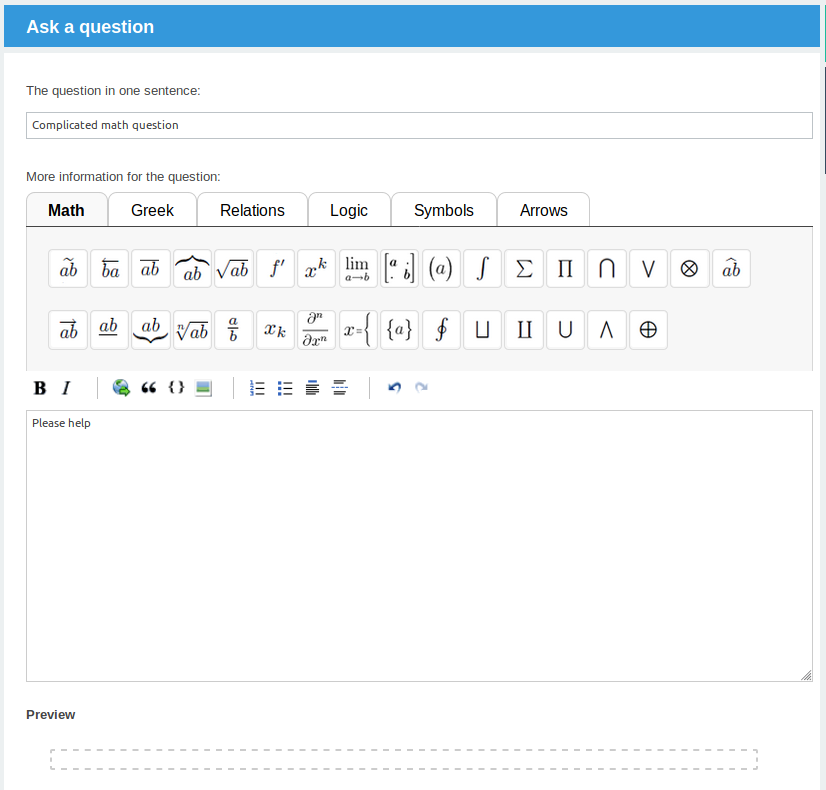

Markdown Editor plugin with LaTeX support for Question2Answer
=================================================

**This repository is no longer maintained and archived**

:warning: CURRENTLY BROKEN :warning:

Check out my [WYSIWYG Math Formulas Editor](https://github.com/thibaultduponchelle/q2a-ckeditor-latex) which is **same same but different** (but more important it is working and tested with 1.8.2) :smile: 

It looks like this but I repeat, it is BROKEN :sob:


Disclaimer
-------------------------------------------------

This is an improved version of the plugin made by **Scott Svivian**. 
[q2a-markdown-editor](https://github.com/svivian/q2a-markdown-editor)

Thanks to him for this great job :)


Introduction
-------------------------------------------------

This is an editor plugin for popular open source Q&A platform, [Question2Answer](http://www.question2answer.org). It uses Markdown to format posts, which is a simple text-friendly markup language using for example \*\*bold\*\* for **bold text** or \> for quoting sources.

The plugin uses modified versions of the PageDown scripts (released by Stack Overflow) for the editor and live preview respectively.


Installation
-------------------------------------------------

1. Download and extract the `markdown-editor` folder to the `qa-plugins` folder in your Q2A installation.
2. Log in to your Q2A site as a Super Administrator and head to Admin > Posting.
3. Set the default editor for questions and answers to 'Markdown Editor'. The editor does also work for comments, but keeping to plain text is recommended.
4. Put this code into Admin, Layout, Custom HTML at top of every page: 
```javascript
    <script type="text/x-mathjax-config">
      MathJax.Hub.Config({
	  extensions: ["tex2jax.js"],
          jax: ["input/TeX","output/HTML-CSS"],
          tex2jax: {inlineMath: [["$","$"],["\\(","\\)"]]},`
          TeX: { extensions: ["AMSmath.js","AMSsymbols.js"]}
      });
    </script>
```
    
5. Put this code into Admin, Layout, Custom HTML in HEAD section of every page: 
```javascript
    <script type="text/javascript"
        src="http://cdn.mathjax.org/mathjax/latest/MathJax.js?config=TeX-AMS-MML_HTMLorMML">
    </script>
```

6. Please check in Admin, General that url structure is like this : 
```
/index.php?qa=123&qa_1=why-do-birds-sing
```

In Admin > Plugins, you can set two options:

- "Plaintext comments" - Sets a post as plaintext when converting answers to comments.
- "Use syntax highlighting" - Integrates [highlight.js](http://softwaremaniacs.org/soft/highlight/en/) for code blocks (including while writing posts). All common programming languages are supported, but you can add more using the [customized download here](http://softwaremaniacs.org/soft/highlight/en/download/). Save the file and overwrite `pagedown/highlight.min.js`. Similarly, any of the custom styles can be added to your stylesheet instead of the provided styles.


Extra bits
-------------------------------------------------

**Converting old posts:** If you have been running your Q2A site for a little while, you may wish to convert old content to Markdown. This does not work reliably for HTML content (created via the WYSIWYG editor); it is pretty safe for plain text content, but check your posts afterwards as some formatting may go awry. You can convert text posts automatically using this SQL query:

```sql
UPDATE qa_posts SET format='markdown' WHERE format='' AND type IN ('Q', 'A', 'Q_HIDDEN', 'A_HIDDEN')
```

(Make sure to change `qa_` above to your installation's table prefix if it is different.)
